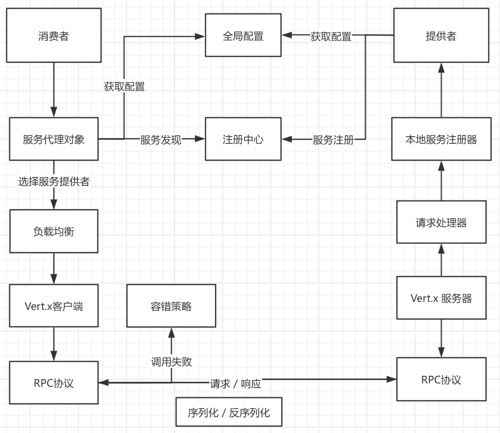

# qin RPC 框架

## 项目介绍

基于 Java + Etcd + Vert.x + 自定义协议实现的高性能RPC框架。qin既是笔者名字，也表示这个RPC框架是轻量级的、易用的，开发者可以引入 Spring Boot Starter，通过注解和配置文件快速使用本框架，像调用本地方法一样轻松调用远程服务。本框架还支持通过 SPI 机制动态扩展序列化器、注册中心、负载均衡器、重试和容错策略等。

开源地址：https://github.com/xiaojun623/qin-rpc

## 项目架构
架构图如下：

## 项目模块

- qin-rpc-core：qin RPC 框架核心代码
- qin-rpc-example-common：示例代码公用模块
- qin-rpc-example-consumer：示例服务消费者
- qin-rpc-example-provider：示例服务提供者
- qin-rpc-example-springboot-consumer：示例服务消费者（Spring Boot 框架）
- qin-rpc-example-springboot-provider：示例服务提供者（Spring Boot 框架）
- qin-rpc-spring-boot-starter：注解驱动的 RPC 框架，可在 Spring Boot 项目中快速使用

## 技术选型

- Java 语言
- Vert.x 框架
- Etcd 云原生存储中间件（jetcd 客户端）
- ZooKeeper 分布式协调工具（curator 客户端）
- SPI 机制
- 多种序列化器
  - JDK 序列化
  - JSON 序列化
  - Kryo 序列化
  - Hessian 序列化
- 多种设计模式
  - 双检锁单例模式
  - 工厂模式
  - 代理模式
  - 装饰者模式
- Spring Boot Starter 开发
- 反射和注解驱动
- Guava Retrying 重试库
- JUnit 单元测试
- Logback 日志库
- Hutool、Lombok 工具库

